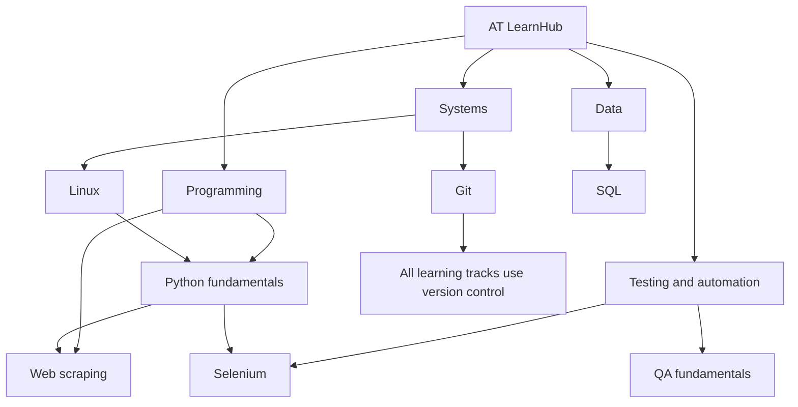

# 🗺️ Learning track relationship map

```mermaid
flowchart TD
    HUB["AT LearnHub"] --> PROG["Programming"]
    HUB --> SYS["Systems"]
    HUB --> DATA["Data"]
    HUB --> TEST["Testing and automation"]
    PROG --> PY["Python fundamentals"]
    PROG --> SCRAPE["Web scraping"]
    SYS --> LINUX["Linux"]
    SYS --> GIT["Git"]
    DATA --> SQL["SQL"]
    TEST --> QA["QA fundamentals"]
    TEST --> SEL["Selenium"]
    PY --> SEL
    PY --> SCRAPE
    LINUX --> PY
    GIT --> ALL["All learning tracks use version control"]
```

Arrows indicate useful learning relationships, not strict prerequisites or a mandatory curriculum.
